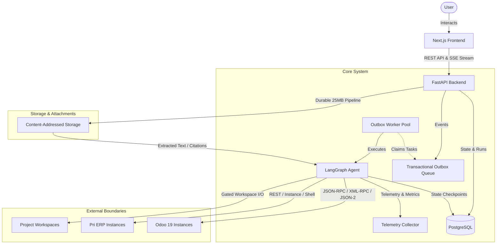

# Primacy ERP Implementation Agent

An autonomous, human-gated AI implementation and pair-programming assistant for **Odoo 19** and **Pri ERP**. The system combines a FastAPI backend, PostgreSQL persistence with LangGraph state checkpoints, an asynchronous transactional outbox worker, and a Next.js 16 split-pane IDE frontend.

## Architecture

The system is designed with a strong separation of concerns, ensuring that all AI agent actions are durable, observable, isolated, and strictly gated by human approval.



## Agent Workflow & Human Gating

The agent uses a Supervisor-Worker pattern. Complex prompts are decomposed into a graph of subtasks. Each subtask is executed by the agent, and every meaningful action is routed through a strict permission protocol.

```mermaid
sequenceDiagram
    participant User
    participant API
    participant Worker
    participant Agent
    participant Odoo

    User->>API: Prompt: "Build Manufacturing Tracker"
    API->>Worker: Enqueue Run
    Worker->>Agent: Decompose into Task Graph
    
    rect rgb(23, 32, 42)
        Note over Worker,Agent: Task 1: Inspect Schema (Class 1)
        Worker->>Agent: Execute Task
        Agent->>Odoo: JSON-RPC (Read Only)
        Odoo-->>Agent: Returns Model Schema
    end
    
    rect rgb(38, 28, 28)
        Note over Worker,Odoo: Task 2: Create Views (Class 2 - Risky)
        Worker->>Agent: Execute Task
        Agent->>API: Request File Write
        API-->>User: Requires Human Approval
        User->>API: Approve
        API->>Worker: Resume Action
        Worker->>Agent: Write File
    end
```



## Core Capabilities

- **Dual ERP Connectors**:
  - **Odoo 19**: Dynamic schema discovery, XML-RPC (`/xmlrpc/2/object`), and JSON-2 (`/web/dataset/call_kw`) with OWL 3 and `<list>` view support.
  - **Pri ERP**: Multi-tenant REST adapter (`admin.sh.prierp.com`) supporting instance inspection, remote workspace file operations, secure terminal bridge, and database backup/restore.
- **Durable 25 MB Attachment Pipeline**: Content-addressed SHA-256 storage, MIME allowlisting, pluggable malware scan hooks, automated text extraction (`pypdf`, plaintext), and evidence citation references.
- **5-Layer Permission Engine**: Workspace directory gating, risk tier classification, command allowlists, ERP grant validation, and LRU-cached evaluation.
- **67-Tool Registry**: Formally typed tool catalog with risk classes (1/2/3), ERP engine compatibility tags, idempotency enforcement, and human-in-the-loop approval cards.
- **Deployment Safety & Auto-Rollback**: Pre-deploy code inspection, view validation, AST checks, automated smoke testing suites, and instant rollback to prior artifact checkpoints.
- **Observability & Health Monitoring**: Latency, token cost, and run reliability metrics via `/admin/telemetry`, plus active tool registry introspection at `/admin/tools`.

## Security Model

- **Authentication:** Local Argon2-backed accounts with administrator and member roles.
- **Isolation:** Organization-scoped projects and ERP connections.
- **Web Security:** HttpOnly session cookies, CSRF protection, explicit CORS/trusted-host configuration.
- **Encryption:** Fernet-encrypted ERP and OpenRouter credentials that are never returned by the API.
- **Persistence:** PostgreSQL-backed agent checkpoints and durable, user-bound action approvals.
- **Risk Classes:** Read-only tools run directly; every filesystem or supported ERP write requires explicit approval.
- **Workspace Gating:** Server-owned workspace paths with traversal, prefix-collision, symlink, and size checks.
- **Auditing:** Fully audited requests, decisions, and execution results.

The model never receives raw ORM methods, domains, SQL, shell commands, filesystem paths, or Git commands. It can inspect allowlisted metadata, create approved master data and draft transactions, and prepare module source. Installation and upgrades occur only through validated artifacts and the separate deployment runner.

## Prerequisites

- Python 3.11+
- Node.js 20+
- PostgreSQL
- An Odoo 19 instance whose hostname is explicitly allowed

## Backend Setup

```bash
cd backend
python3 -m venv venv
source venv/bin/activate
pip install -e '.[test]'
cp .env.example .env
```

Generate `ENCRYPTION_KEY` once with `python -c "from cryptography.fernet import Fernet; print(Fernet.generate_key().decode())"`. Keep it outside source control; losing or changing it makes stored credentials unreadable.

Set `ERP_ALLOWED_HOSTS` to exact approved hostnames or explicit suffixes such as `.internal.example`. Production deployments must use HTTPS, set `SECURE_COOKIES=true`, and set exact frontend and trusted-host values.

Migrate the database and create the initial administrator:

```bash
alembic upgrade head
python manage.py create-admin admin@example.com
```

Start the supervised development stack (launches both the API and the background worker with live reload):

```bash
python manage.py serve --reload --port 8001
```

For production deployments, manage the stack via systemd:

```bash
sudo systemctl enable --now primacy.target
```

Agent use is disabled until an administrator configures an OpenRouter key, selects a catalogue-validated model, and sets an organization monthly budget.

## Frontend Setup

```bash
cd frontend
npm install
npm run dev
```

Set `NEXT_PUBLIC_API_URL` when the API is not at `http://localhost:8001`.

## Quality Gates

```bash
cd backend && pytest && python -m compileall -q .
cd frontend && npm run lint && npm test && npx tsc --noEmit && npm run build
```

After the first administrator signs in, create an organization, add projects, configure the OpenRouter model/key under Settings, and connect approved Odoo instances. Existing prototype credentials must be re-entered.

## Deployment Targets

### On-premise Odoo 19

1. Install `odoo_addons/primacy_deployment_bridge` manually and generate a strong bridge token in Odoo system parameter `primacy_bridge.api_token`.
2. Create a least-privileged operating-system account that can write only the custom-addons and runner backup directories and can invoke only the configured Odoo command/service policy.
3. In the connection screen, configure the bridge URL/token. Copy the returned Ed25519 public key into a runner configuration based on `bridge_runner/config.example.json`.
4. Store `PRIMACY_BRIDGE_TOKEN` in the runner service secret store, not in its JSON file, and start `python -m bridge_runner.runner --config /etc/primacy-runner.json`.
5. Configure `PUBLIC_BASE_URL` as an HTTPS URL reachable by the runner. Allow that hostname in the runner's `allowed_artifact_hosts`.

The Odoo web process only stores and reports jobs. The runner independently verifies signature, nonce, expiry, digest, archive contents, module name, and fixed command arguments. Failed upgrades restore the retained prior artifact.

### Odoo.sh

Configure an administrator-approved `ssh://` or HTTPS repository URL, staging branch template, and encrypted deploy key on the instance. Deployments push the exact validated workspace commit to a `primacy/<project>/<release>`-style branch. Promotion remains gated on the same digest, successful staging, UAT evidence, rollback plan, and a different Class E approver.

Odoo Online custom Python deployment is intentionally unsupported.

## Recovery and Operations

- The worker runs a recovery sweep on startup. Expired approvals are rejected into their waiting checkpoint; stale runs become retryable interruptions; unclaimed outbox work is returned to the queue.
- Run history includes typed tool/message/approval/usage events and support IDs. Administrators can search audit events, export safe CSV, inspect queue health, and revoke sessions.
- Back up PostgreSQL, the project workspace root, deployment-runner backups, bridge tokens, signing keys, and Odoo databases before production promotion. Rotate a bridge token or signing key by updating the application target and runner together.
